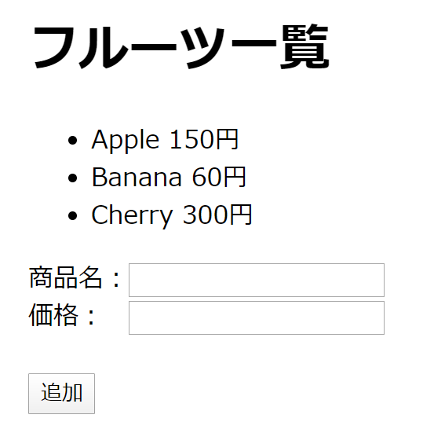
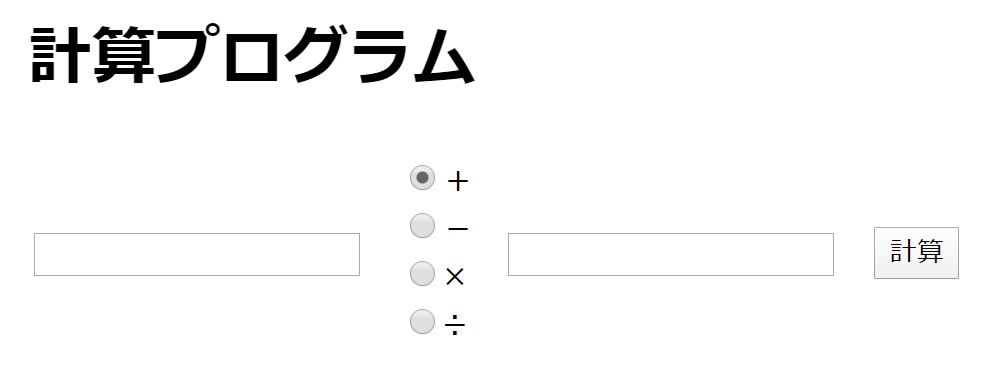
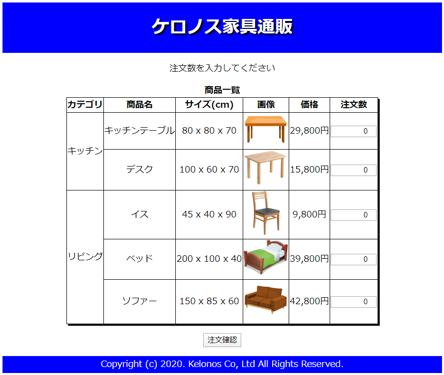
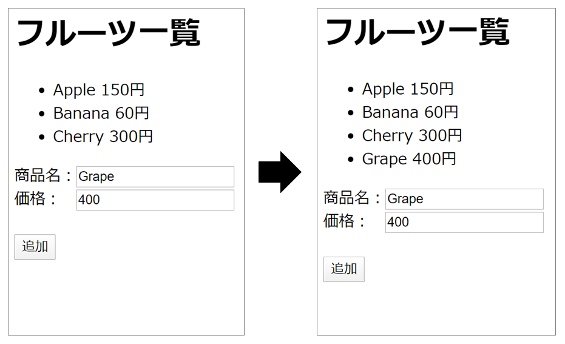
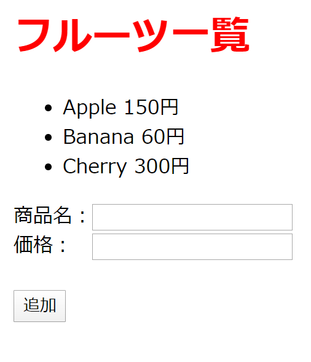
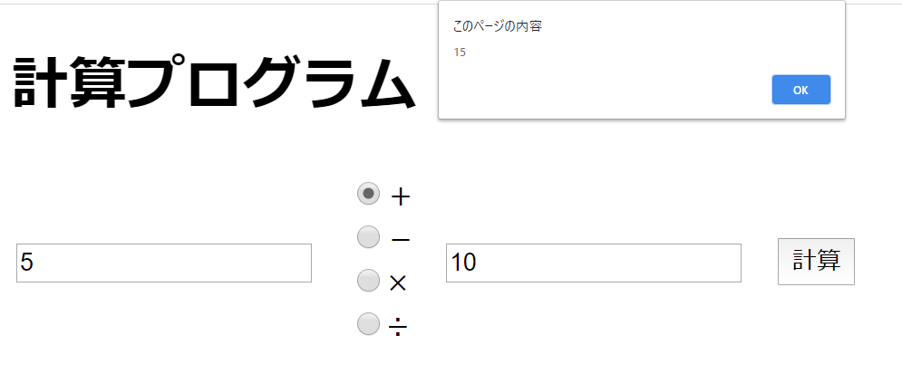

# HTML/CSS 演習問題

### 演習1

HTML/CSSを用いて以下のような画面を作成しなさい。

<!-- [解答例](ans/html-css1.md) -->

 

### 演習2

HTML/CSSを用いて以下のような画面を作成しなさい。

<!-- [解答例](ans/html-css2.md) -->

 

### 演習3

HTML/CSSを用いて以下のような画面を作成しなさい。

【使用画像】※以下のリンクから画像を保存して使用してください。 
<a href="images/table.png" download="images/table.png">table.png</a> 
<a href="images/desk.png" download="images/desk.png">desk.png</a> 
<a href="images/chair.png" download="images/chair.png">chair.png</a> 
<a href="images/bed.png" download="images/bed.png">bed.png</a> 
<a href="images/sofa.png" download="images/sofa.png">sofa.png</a>

<!-- [解答例](ans/html-css3.md) -->

 

### 演習4

演習1で作成したHTMLに対し、JavaScriptを用いて以下の動作を加えなさい。

- [登録]ボタン押下時に、テキストボックスに入力された商品名と価格をリストに追加する。

<!-- [解答例](ans/html-css4.md) -->

 

### 演習5

演習1で作成したHTMLに対し、JavaScriptを用いて以下の動作を加えなさい。

- タイトル「フルーツ一覧」のマウスオーバー時に、文字色が黒の場合は赤にし、文字色が赤の場合は黒にする。

<!-- [解答例](ans/html-css5.md) -->

 

### 演習6

演習2で作成したHTMLに対し、JavaScriptを用いて以下の動作を加えなさい。

- [計算]ボタン押下時に、1つ目の数値と2つ目の数値の計算結果をアラート表示する。
- 計算方法は、ラジオボタンで選択した演算記号によって変わる。

<!-- [解答例](ans/html-css6.md) -->
